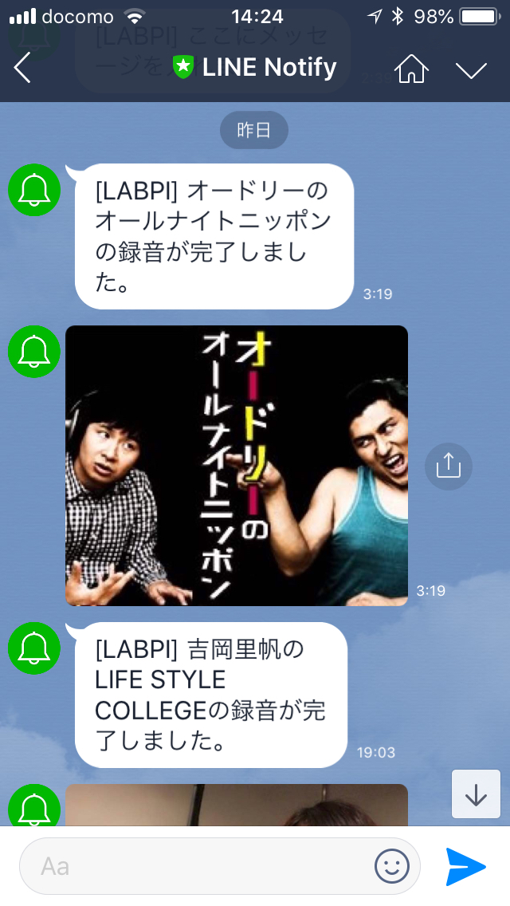

# record-radiko
http://kyoshiaki.hatenablog.com/entry/2014/05/04/184748 を参考に録音したmp3ファイルにeyed3でタグをつけて、さらにLINEに録音完了の通知を行うようにする。以下では録音はraspberry piで行うことを想定する。

# 準備
raspberry piで以下のプログラムをインストールする。
```
$ sudo apt-get update
$ sudo apt-get install rtmpdump swftools libxml2-utils ffmpeg eyed3
```
LINEからの通知を行うために、LINE Notify( https://notify-bot.line.me/ja/ )を利用する。radiko録音のためのアクセストークンを発行し、コピーしておこう。


# 録音
オードリーのオールナイトニッポンを録音してみよう。raspberry pi上で
```
git clone https://github.com/yonesuke/record-radiko.git
```
を行う。
録音したラジオ音源を`~/Music/audrey/`に保存する場合、
```
mv rec_radiko2.sh line.py ~/Music/audrey/
```
とする。
ラジオ音源にアートワークをつけるために好きな画像を`audrey.jpg`という名前で`~/Music/audrey/`に保存しておこう。
LINE Notifyのアクセストークンを`Lconfig.py`に保存する。アクセストークンが`hogefuga`の場合、`Lconfig.py`内を
```
APItoken = "hogefuga"
```
とする。
これで録音ができるようになる。
radikoのメールアドレスが`hoge@hige.com`、パスワードが`password`の場合、土曜日の25時に
```
bash rec_radiko2.sh LFR 120 hoge@hige.com password ~/Music/audrey
```
を実行すれば良い。LINEには次のような通知が来る。


毎週土曜日の25時に起きて実行するのは非常に手間なので、ジョブを自動実行してくれるcronを用いる。その実行ファイルは`crontab -e`で設定できる。筆者は次のように設定している。
```
$ crontab -l
0 1 * * 0 bash ~/Music/audrey/rec_radiko2.sh LFR 120 hoge@hige.com password ~/Music/audrey
```
それでは楽しいradiko生活を！
